Here’s a **Mermaid diagram** that visually represents the **circuit breaker** logic and **CPU load generation** process:

```mermaid
graph TD;
    
    subgraph Circuit Breaker Mechanism
        A1(Circuit Closed) -->|Call Function| B1{Execution Succeeds?}
        B1 -->|Yes| C1[Reset Failure Count]
        B1 -->|No| D1[Increment Failure Count]
        D1 -->|Failure Threshold Reached?| E1{Open Circuit?}
        E1 -->|Yes| F1[Open Circuit - Reject Calls]
        F1 -->|Wait Recovery Timeout| G1[Try Half-Open State]
        G1 -->|Test Call Success?| H1{Close Circuit?}
        H1 -->|Yes| I1[Reset Failure Count, Close Circuit]
        H1 -->|No| F1
    end

    subgraph CPU Load Generator
        A2(Start CPU Load Generation) --> B2[Check CPU Cores]
        B2 --> C2[Spawn Processes]
        C2 --> D2[Generate High CPU Load]
        D2 --> E2{Exception Occurred?}
        E2 -->|Yes| F2[Log Error, Trigger Circuit Breaker]
        E2 -->|No| G2[Successful Execution]
        F2 -->|Circuit Open?| H2{Use Fallback?}
        H2 -->|Yes| I2[Return Cached Data]
        H2 -->|No| J2[Rethrow Exception]
    end
    
    style A1 fill:#4CAF50,stroke:#333,stroke-width:2px;
    style F1 fill:#FF5733,stroke:#333,stroke-width:2px;
    style I2 fill:#FFC300,stroke:#333,stroke-width:2px;
    style D2 fill:#2196F3,stroke:#333,stroke-width:2px;
```

### 🔹 **Explanation of the Diagram**
1. **Circuit Breaker**
   - Starts **closed** (A1), allowing function execution.
   - If failures occur (D1), it increments the failure count.
   - If the threshold is reached, the circuit **opens** (F1), blocking calls.
   - After a timeout, it **half-opens** (G1) to test recovery.
   - If the test call succeeds, the circuit **closes** (I1); otherwise, it remains **open**.

2. **CPU Load Generator**
   - Determines the number of CPU cores (B2).
   - Spawns parallel processes (C2) to simulate **high CPU load** (D2).
   - If an exception occurs (E2), it triggers the circuit breaker (F2).
   - If the circuit is **open**, it falls back to cached data (I2).
   - Otherwise, it rethrows the exception (J2).

This diagram effectively captures how the **circuit breaker protects the CPU load generator** from excessive failures! 🚀 

Would you like any refinements? 😊